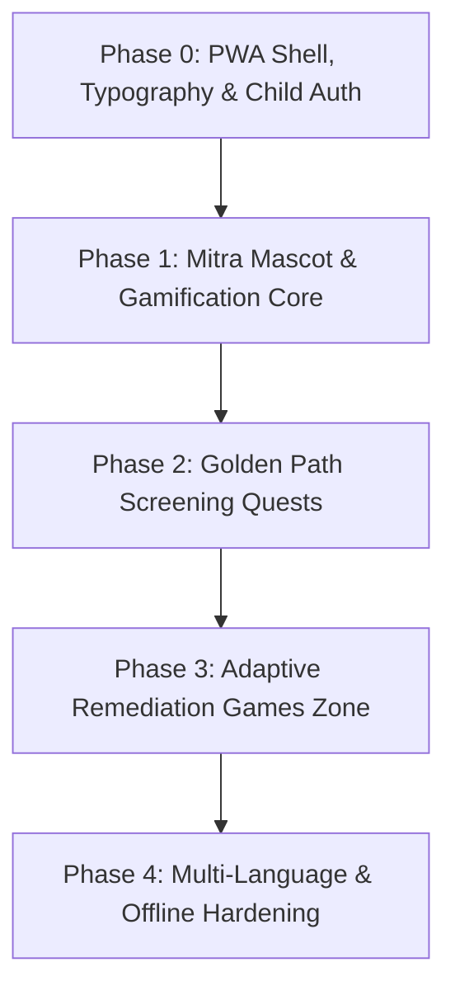

# AksharMitra — Comprehensive Microphases & Implementation Roadmap
### Hacksynthesis UEM 30-Hour Hackathon Blueprint

> **Vision**: An offline-first, gamified assistive learning and non-stigmatizing early dyslexia risk-screening Progressive Web App (PWA) built for child engagement, multi-sensory phonics, and early literacy support.

---

## 🎯 Core Architectural Principles
1. **Student-Centric Primary Flow**: The child experiences playful quests with the mascot *Mitra*; clinical metrics are silently computed in the background.
2. **Kid-First Engagement**: 100% focused on student joy (avatars, star rewards, zero-stigma games, cheerful Web Audio chimes).
3. **Phonics & Reversal Pedagogy**: Targeting visual and auditory confusions (e.g., *b/d/p/q*, *m/w*, *n/u*, rhyming phonemes, and initial letter isolation).
4. **Gentle Failure UX**: Zero red crossbars, zero harsh buzzer sounds; encouraging micro-animations, voice guidance, and positive reinforcement at all times.
5. **Hackathon Demo Resilience**: Instant zero-latency Web Audio API synthesizer, Sing-Along karaoke demo fallback, and fast non-linear quest navigation.

---

## 🗺️ Microphases Roadmap

---

### Phase 0: PWA Foundation, Typography & Audio Engine ✅
- [x] **0.1 Project Scaffolding & Build Pipeline**
  - [x] Set up Vite + React + Vanilla CSS (Mobile-first, responsive viewport for phones, tablets & desktop).
  - [x] Clean directory structure: `/components`, `/games`, `/screening`, `/context`, `/data`, `/assets`.
- [x] **0.2 Child-Friendly Visual & Sensory Design System**
  - [x] Warm, high-contrast, dyslexia-friendly palette (warm creams, soothing indigo, joyful amber, soft emerald; avoiding harsh stark blacks).
  - [x] Typography integration: High-legibility dyslexic-friendly fonts (*Lexend*, *Inter*) for optimal readability.
  - [x] Touch target standardization (minimum 48px–64px hit targets for small hands).
  - [x] Micro-animation tokens (gentle bounce, pulse glow, star burst, confetti particles).
- [x] **0.3 Child Profile Management**
  - [x] **Student Profile Creator**: Friendly nickname, grade level, language selection (English primary, Bengali preview), and interactive avatar picker.
  - [x] **Profile Switcher**: 1-click modal to switch between child explorer profiles.
- [x] **0.4 Local-First Storage & Web Audio Engine**
  - [x] LocalStorage state persistence for student profiles, stars, streaks, and quest history.
  - [x] Web Audio API synthetic chime synthesizer (soft chime, star twinkle fanfare, gentle pop, bubble sound) with zero external asset latency.
  - [x] Web Speech API (TTS & Speech Recognition) with offline Sing-Along demo fallback.

---

### Phase 1: Mascot & Gamification Infrastructure ✅
- [x] **1.1 Mascot System ("Mitra" / The Friendly Companion)**
  - [x] Mascot component with reactive animated avatar states:
    - `idle` (waving, blinking)
    - `talking` (mouth synchronized with cheerful voice prompts)
    - `thinking` (encouraging look)
    - `celebrating` (jumping with star confetti)
  - [x] Mascot speech bubble with natural English voice synthesis.
- [x] **1.2 Gamification & Motivation Loop**
  - [x] Star reward system awarded for participation and effort.
  - [x] Daily streak tracker.
  - [x] Quest Master Badge unlocking celebration with confetti cannons.
- [x] **1.3 Gentle Failure & Scaffolding Engine**
  - [x] Friendly voice hints on mispronounced or mistaken cards.
  - [x] Zero negative scores, zero red crosses, zero penalties.

---

### Phase 2: Stealth Screening Quests Suite ✅
- [x] **2.1 Quest 1: "Letter Tracing" (Visual & Graphomotor Reversal Tracing)**
  - [x] Interactive HTML5 Canvas tracing engine with magnetic glowing guideline dots and uniform brush stroke.
  - [x] A-Z letter carousel with special focus on reversal letters: **b**, **d**, **p**, **q**.
  - [x] Multi-stroke letter support (**i**, **j**, **t**, **x**, **f**).
  - [x] Metric extraction: Stroke tracing accuracy, deviation scoring, reversal tracking.
- [x] **2.2 Quest 2: "Read Aloud" (Speech-to-Text & Fluency Analyzer)**
  - [x] Illustrated story sentences (*The Big Dog*, *The Cat & Star*, *Sunny Garden*).
  - [x] Real-time Web Speech API recognition with synchronized word-by-word karaoke highlighting.
  - [x] Dual-path token alignment and phonetic typo matching for child speech.
  - [x] Tap-to-pronounce fallback and Sing-Along Auto Demo mode.
  - [x] Metric extraction: Words Per Minute (WPM), Fluency Accuracy %, hesitation count.
- [x] **2.3 Quest 3: "Rhyme Magic" (Auditory Phonological Awareness)**
  - [x] 4 Auditory rhyme puzzles (*Cat/Hat*, *Frog/Dog*, *Star/Car*, *Bed/Red*).
  - [x] Auto-narrated prompt on puzzle start and transition.
  - [x] Tactile option cards with sound feedback and reward chimes.
- [x] **2.4 Quest 4: "Sound Safari" (Odd-One-Out Phoneme Isolation)**
  - [x] 4 Safari missions isolating initial letter sounds (*B, S, M, D*).
  - [x] Clean natural voice prompts and card pronunciation.
  - [x] Detective reward badges and friendly phonetic feedback.
- [x] **2.5 Master Screening Container**
  - [x] 5-Step interactive flow with free non-linear pill navigation between all quests.
  - [x] Celebratory completion screen awarding +30 Star Bonus and Master Explorer Badge.

---

### Phase 3: Adaptive Remediation Games Zone ✅
- [x] **3.1 Games Zone Hub (`GamesHub.jsx`)**
  - [x] Central game selection dashboard with Mitra mascot guidance and category badges.
  - [x] Direct navigation from header and landing page.
- [x] **3.2 Signature Game: "Word Snapper" (Phonics & Magnetic Tile Builder)**
  - [x] Drag-and-drop / tap-to-place letter tiles into word slots with magnetic snapping animations.
  - [x] Target reversal confusion letter highlighting (*b/d/p/q*).
  - [x] Mnemonic cue boxes explaining letter orientations.
  - [x] Real-time TTS phoneme blending as tiles are placed.
- [x] **3.3 Mini Game: "Letter Hunter" (Visual Discrimination Grid)**
  - [x] Rapid visual spotting grid targeting deceptive letter confusions (*b vs d*, *p vs q*, *m vs w*, *n vs u*).
  - [x] Combo multiplier badge, gentle mistake wiggle animations, and star rewards.

---

### Phase 4: Polish, Multi-Language & Hackathon Presentation 🚀
- [x] **4.1 Production Build & Code Quality**
  - [x] Vite production bundle passes with 0 errors (1912+ modules compiled).
  - [x] Clean git commit history on `main` branch.
- [x] **4.2 Service Worker Offline PWA Caching**
  - [x] Standalone PWA Web App Manifest (`public/manifest.json`) & offline Service Worker (`public/sw.js`).
- [x] **4.3 Live Demo Deployment Readiness**
  - [x] SPA routing rewrite configuration (`vercel.json`) & comprehensive `README.md`.

---

## 📊 Feature Delivery Status Matrix

| Phase | Feature Set | Complexity | Status |
|---|---|---|---|
| **Phase 0** | PWA Scaffolding, Dyslexia Typography & Web Audio Engine | Medium | ✅ Complete |
| **Phase 1** | Mitra Mascot, Rewards Loop & Gentle Failure UX | Medium | ✅ Complete |
| **Phase 2** | 4 Stealth Screening Quests (Tracing, Read-Aloud, Rhyme, Safari) | High | ✅ Complete |
| **Phase 3** | Remediation Games Zone (Word Snapper & Letter Hunter) | High | ✅ Complete |
| **Phase 4** | Offline PWA, Vercel SPA Deploy & Documentation Showcase | Medium | ✅ Complete |

