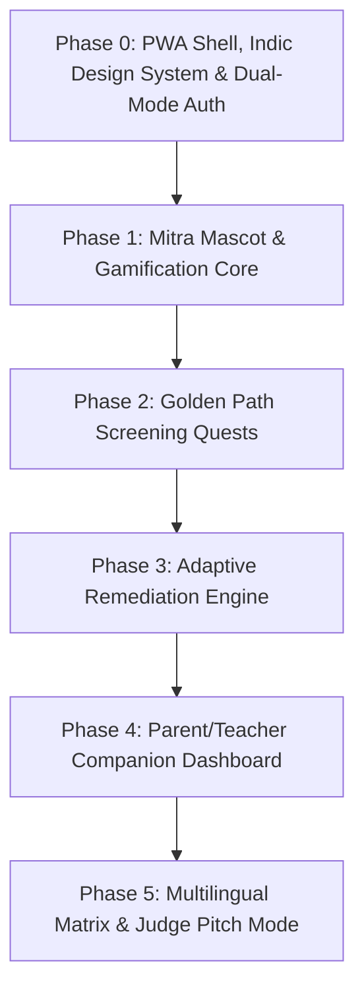

# AksharMitra — Comprehensive Microphases & Implementation Roadmap
### Hacksynthesis UEM 30-Hour Hackathon Blueprint

> **Vision**: An offline-first, gamified assistive learning and non-stigmatizing early dyslexia risk-screening Progressive Web App (PWA) built script-first for Indian languages (Devanagari, Bengali, Tamil).

---

## 🎯 Core Architectural Principles
1. **Student-Centric Primary Flow**: The child experiences playful quests with the mascot *Mitra*; clinical metrics are silently computed in the background.
2. **Dual-Mode Profiles (Student First + Companion Educator View)**: Focus 85% of UX on student engagement (avatars, rewards, zero-stigma games) with a streamlined PIN-protected Companion View for parents/teachers to view analytics.
3. **Script-Native Pedagogy**: Confusion matrices specifically tailored to Indian scripts (e.g., ब/भ, द/ध, प/फ, matra placement) rather than direct translations of Latin b/d confusions.
4. **Gentle Failure UX**: Zero red crossbars, zero harsh buzzer sounds; encouraging micro-animations and positive reinforcement at all times.
5. **Hackathon Demo Resilience**: Instant 1-Click Judge Demo Pass, offline audio synthesizer, and simulated speech visualizer fallback for noisy venue conditions.

---

## 🗺️ Microphases Roadmap

---

### Phase 0: PWA Foundation, Indic Design System & Auth Engine
- [ ] **0.1 Project Scaffolding & Build Pipeline**
  - [ ] Set up Vite + React + Vanilla CSS (Mobile-first, responsive viewport for phones, tablets & desktop).
  - [ ] Configure PWA manifest (`manifest.json`) and Service Worker for standalone installability and offline caching.
  - [ ] Modular directory structure: `/components`, `/games`, `/screening`, `/services`, `/store`, `/assets`, `/audio`, `/data`.
- [ ] **0.2 Child-Friendly Visual & Sensory Design System**
  - [ ] Warm, high-contrast, dyslexia-friendly palette (warm creams, soothing blues, joyful amber, soft mint; avoiding stark pitch-black-on-pure-white).
  - [ ] Typography integration: Clean, high-legibility Indic fonts (*Noto Sans Devanagari*, *Rozha One*) and *OpenDyslexic* / *Lexend* for dual-script readability.
  - [ ] Touch target standardization (minimum 48px–64px hit targets for small hands).
  - [ ] Micro-animation tokens (gentle bounce, wiggle, star burst, confetti particles).
- [ ] **0.3 Dual-Mode Auth & Profile Management**
  - [ ] **Student Profile Creator (Primary Focus)**: Friendly name/nickname, grade level (Class 1-5), language selection (Hindi / Bengali / Tamil), and interactive avatar picker.
  - [ ] **Parent/Teacher Companion Access**: Simple PIN code (e.g., 4-digit PIN) to unlock educator analytics and student switching.
  - [ ] **Instant Judge Demo Pass (1-Click Sandbox)**:
    - 🧒 *Aarav (Grade 2)* — Pre-flagged with Devanagari reversal confusion (ब vs भ).
    - 👧 *Priya (Grade 3)* — Typical progression benchmark profile.
    - 🆕 *Fresh Quest Mode* — Instant clean student walkthrough for live demo.
- [ ] **0.4 Local-First Storage & Audio Engine**
  - [ ] IndexedDB / LocalStorage state persistence for profiles, game history, and screening vectors.
  - [ ] Web Audio API synthesizer for cheerful sound effects (soft chime, star twinkle, gentle pop, slide sound).
  - [ ] Web Speech API (TTS & Speech Recognition) with offline / simulated speech fallback for noisy pitch environments.

---

### Phase 1: Mascot & Gamification Infrastructure
- [ ] **1.1 Mascot System ("Mitra" / The Friendly Companion)**
  - [ ] Mascot component with reactive animated avatar states:
    - `idle` (waving, blinking)
    - `talking` (mouth flap synchronized with audio prompt)
    - `thinking` (encouraging look)
    - `celebrating` (jumping with stars)
    - `guiding` (pointing to interactive UI elements)
  - [ ] Mascot speech bubble with bilingual voice prompts (Hindi & Indian English).
- [ ] **1.2 Gamification & Motivation Loop**
  - [ ] Star & gem reward system awarded for participation and effort, not speed.
  - [ ] Daily streak tracker with visual adventure map.
  - [ ] Badge trophy room (e.g., "Akshar Hero", "Dhwani Master", "Speedy Explorer").
- [ ] **1.3 Gentle Failure & Scaffolding Engine**
  - [ ] Adaptive Hint System: 1st hesitation = verbal encouragement; 2nd = visual glow; 3rd = mascot demonstrates correct stroke/sound.
  - [ ] Zero negative scores, zero red crosses, zero penalty counters.

---

### Phase 2: Golden Path Stealth Screening Quests (~5-7 min Playful Flow)
- [ ] **2.1 Task A: "Akshar Rekha" (Canvas Letter & Reversal Tracing)**
  - [ ] Interactive HTML5/Canvas tracing engine with stroke-path guideline dots.
  - [ ] Real-time stroke vector analysis (direction, starting point, curvature, stroke hesitation).
  - [ ] Script confusion tests:
    - Devanagari mirrors/confusions: **ब** vs **भ**, **द** vs **ध**, **प** vs **फ**, **म** vs **भ**.
    - Numerical mirrors: **3** vs **६**, **6** vs **9**, **2** vs **5**.
  - [ ] Metric extraction: Stroke reversal probability, hesitation index, spatial deviation score.
- [ ] **2.2 Task B: "Bol Mitra Bol" (Read-Aloud & Fluency Analyzer)**
  - [ ] Short, age-appropriate illustrated story sentence prompts with karaoke-style synchronized text highlights.
  - [ ] Speech recording via microphone with real-time audio waveform visualizer.
  - [ ] Phoneme & word comparison engine:
    - Levenshtein & phonetic distance between expected sentence and transcribed speech.
    - Detection of word omissions, insertions, and long hesitation pauses (>1.5s).
    - **Venue Fail-Safe**: Interactive "Tap-to-Speak" fallback simulation if microphone fails in noisy room.
  - [ ] Metric extraction: Words Per Minute (WPM), Fluency Accuracy %, Phoneme substitution frequency.
- [ ] **2.3 Task C: "Dhwani Shikaar" (Phonological & Syllable Rhythm Clapping)**
  - [ ] Rhyming identification game (matching "नल" with "जल" vs "घर").
  - [ ] Syllable tapping / beat game (tap the drum for each syllable in "पा-ठ-शा-ला").
  - [ ] Sound blending & segmentation (/क/ + /म/ + /ल/ -> "कमल").
  - [ ] Metric extraction: Phonological discrimination error rate, auditory processing reaction time.
- [ ] **2.4 Screening Aggregator & Risk Assessment Matrix**
  - [ ] Weighted scoring formula integrating:
    - $R_{rev}$ (Reversal & Motor Index)
    - $F_{read}$ (Fluency & Reading Hesitation Index)
    - $P_{phon}$ (Phonological Awareness Index)
  - [ ] Risk banding classification: `Typical Progression`, `Mild Observation Recommended`, `Elevated Risk (Early Support Recommended)`.
  - [ ] Celebratory student outro with confetti & reward badge (no clinical jargon displayed to the child).
  - [ ] **Judge Fast-Forward**: Dev toggle to jump between screening tasks in 5 seconds during pitch.

---

### Phase 3: Script-Native Adaptive Remediation Engine
- [ ] **3.1 Screening-to-Remediation Dynamic Bridge**
  - [ ] Automatically route the child to targeted learning modules based on screening results (e.g., if reversal detected in **ब/भ**, launch the **ब/भ Matra Adventure**).
- [ ] **3.2 Signature Game: "Akshar Jod" (Phonics & Matra Word Builder)**
  - [ ] Drag-and-drop letter and matra tiles into word slots with magnetic snapping and tactile animations.
  - [ ] Real-time audio phoneme blending as tiles connect (e.g., 'क' + 'ा' = 'का').
  - [ ] Progressive difficulty tiers:
    1. Consonant identification
    2. Two-letter root words (कम, नल, घर)
    3. Matra combinations (काला, किताब)
    4. Sanyukt-akshar / conjuncts (मित्र, ज्ञान)
- [ ] **3.3 Mini Game: "Drishti Khoj" (Visual Discrimination & Rapid Spotting)**
  - [ ] Rapid visual search grid: find the target letter among deceptive visual distractors (find 'ब' among 'भ' and 'व').
  - [ ] Calibrated visual density scaling based on child's performance.
- [ ] **3.4 Dynamic Difficulty Adjuster (DDA)**
  - [ ] Rolling trial performance window (adapts visual cues and hints in real time).

---

### Phase 4: Parent & Educator Companion Dashboard
- [ ] **4.1 Secure Companion View Access**
  - [ ] PIN-gated toggle from app header to switch between Child Adventure and Parent/Teacher View.
  - [ ] Multi-student switcher with quick profile stats.
- [ ] **4.2 Visual Risk & Progress Analytics**
  - [ ] Radar / Spider chart displaying 4 developmental axes:
    - Phonological Awareness
    - Visual Discrimination
    - Reading Fluency & Speed
    - Graphomotor & Tracing Accuracy
  - [ ] Historical session timeline showing improvement trends across sessions.
- [ ] **4.3 Actionable Guidance & Non-Diagnostic Recommendations**
  - [ ] Plain-language explanations of observed patterns (*"Child showed difficulty distinguishing 'ब' and 'भ' across 4 trials"*).
  - [ ] At-home sensory games (sand-tray writing, rhythm clapping).
  - [ ] Referral notice: Guidance on when to consult teachers, ASHA workers, or local PRASHAST/DIET centers.
- [ ] **4.4 One-Click PDF/Printable Summary Card**
  - [ ] Clean, printer-friendly summary report for parent-teacher meetings.

---

### Phase 5: Multilingual Matrix, Offline Hardening & Pitch Polish
- [ ] **5.1 Script Confusion Matrix Showcase**
  - [ ] Modular script configuration schema (`/data/languages/hindi.json`, `bengali.json`, `tamil.json`).
  - [ ] Full Hindi pilot gameplay + 1-click interactive preview of Bengali (ব vs র vs ক) and Tamil (ண vs ன vs ந) confusion matrices.
- [ ] **5.2 PWA Offline Bundling & Resilience**
  - [ ] Service Worker cache for all audio sprites, fonts, and assets.
  - [ ] Graceful degradation for low-end Android mobile browsers.
- [ ] **5.3 Presentation & Demo Enhancements (Judges Ready)**
  - [ ] Embedded "Why AksharMitra?" comparison modal (DALI, PRASHAST, DIKSHA differentiation).
  - [ ] Interactive 3-minute pitch mode timer & live walkthrough checklist.

---

## 📊 Feature Delivery Status Matrix

| Phase | Feature Set | Complexity | Status |
|---|---|---|---|
| **0.1-0.4** | PWA Scaffolding, Indic Fonts, Dual Auth & Judge Pass | Medium | ⏳ Ready to Start |
| **1.1-1.3** | Mitra Mascot, Gamification & Gentle Failure UX | Medium | ⏳ Queued |
| **2.1-2.4** | 3 Stealth Screening Quests & Risk Matrix | High | ⏳ Queued |
| **3.1-3.4** | Dynamic Remediation ("Akshar Jod" & DDA) | High | ⏳ Queued |
| **4.1-4.4** | Parent/Teacher Companion Dashboard & PDF Card | Medium | ⏳ Queued |
| **5.1-5.3** | Multilingual Showcase, Offline Cache & Pitch Mode | Medium | ⏳ Queued |
