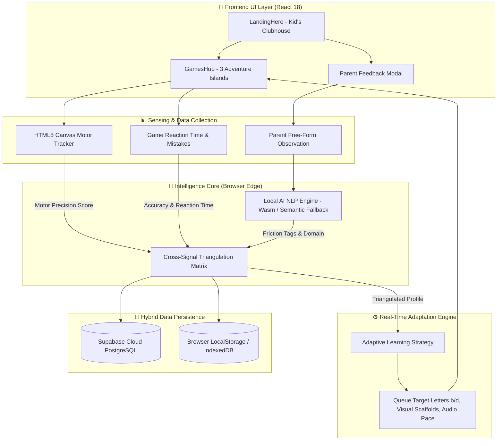

# 📘 AksharMitra: Master Project Manual & Knowledge Base

> **Project Name:** AksharMitra (অক্ষরমিত্র / अक्षरमित्र)  
> **Repository:** `Biraj021/AksharMitra`  
> **Target Audience:** Project Defense, Mentor Reviews, Technical Viva, and Hackathon Evaluations  
> **Core Mission:** An accessible, privacy-first, multilingual early literacy & cognitive screening platform for neurodiverse children (Dyslexia & Dyscalculia) in English, Bengali (বাংলা), and Hindi (हिंदी).

---

## 📑 Table of Contents
1. [Executive Summary (The 30-Second Pitch)](#1-executive-summary)
2. [Complete Tech Stack & Tools Breakdown](#2-complete-tech-stack--tools-breakdown)
3. [End-to-End System Architecture & Data Flow](#3-end-to-end-system-architecture--data-flow)
4. [Deep Dive into Core Subsystems](#4-deep-dive-into-core-subsystems)
   - [A. Motor & Tracing Screening Engine](#a-motor--tracing-screening-engine)
   - [B. On-Device Local AI NLP Engine](#b-on-device-local-ai-nlp-engine)
   - [C. Cross-Signal Intelligence Fusion Matrix](#c-cross-signal-intelligence-fusion-matrix)
   - [D. Dynamic Adaptive Strategy Engine](#d-dynamic-adaptive-strategy-engine)
   - [E. Hybrid Database (Supabase + Offline Cache)](#e-hybrid-database-supabase--offline-cache)
5. [Complete Source Code File Directory Map](#5-complete-source-code-file-directory-map)
6. [PII & Privacy Protection Blueprint](#6-pii--privacy-protection-blueprint)
7. [Master Cheatsheet: Common Mentor & Viva Questions](#7-master-cheatsheet-common-mentor--viva-questions)

---

## 1. Executive Summary

### The Problem
* **1 in 10 children** experience reading or cognitive friction (such as dyslexia, dyscalculia, or mirror-letter confusion).
* Traditional clinical diagnostic tools are **expensive, stressful for 4–9 year olds, and happen too late** (typically at age 8 or 9 after confidence is lost).
* Regional language learners (Bengali & Hindi) have **almost zero localized early screening tools**.
* Cloud-based AI tools risk sending sensitive child behavioral telemetry to third-party servers.

### The Solution: AksharMitra
AksharMitra replaces scary paper tests with an **interactive 3-Island Learning Adventure**. While children play games with their owl companion **Mitra 🦉**, the application silently captures motor precision, stroke directionality, and phonics recognition.

The system processes parent observations using **100% On-Device WebAssembly NLP**, runs a **Cross-Signal Triangulation Engine** to eliminate false positives, and dynamically modifies game difficulty, letter queues, and audio speed in real time.

---

## 2. Complete Tech Stack & Tools Breakdown

| Tool / Technology | Specific Package / API | Exact Purpose in AksharMitra | Why It Was Chosen |
| :--- | :--- | :--- | :--- |
| **Frontend Framework** | **React 18** (`react`, `react-dom`) | Manages UI components, game state loops, active child profiles, stars, and quest progress. | Declarative reactive state management and component reusability. |
| **Build Tool & Dev Server** | **Vite 6** (`vite`) | Compiles and bundles ES modules, provides Hot Module Replacement (HMR). | Extremely fast build times (under 3.5s) and native WebAssembly support. |
| **On-Device Edge AI** | **`@xenova/transformers`** (ONNX WebAssembly) | Runs NLP models (`all-MiniLM-L6-v2`) locally in the browser to parse parent notes into friction tags. | **$0 cloud cost**, 100% child data privacy, and offline capabilities. |
| **Motor Tracing Pad** | **HTML5 2D Canvas API** + **Pointer Events** | Draws letter guide paths (`A-Z`, `a-z`, Bengali, Hindi) and captures real-time touch point coordinates. | Low-latency $(x, y)$ coordinate capture for calculating stroke deviation and hand tremor. |
| **Speech & Phonics Engine** | **Web Speech API** (`window.speechSynthesis`) | Synthesizes Mitra 🦉's spoken voice prompts in English (`en-US`), Bengali (`bn-IN`), and Hindi (`hi-IN`). | Native browser API requiring zero external audio bandwidth. |
| **Sound Synthesizer** | **Web Audio API** (`AudioContext`, `OscillatorNode`) | Dynamically synthesizes chimes, correct answer pops, and star twinkling sound effects. | Zero audio asset download latency; instant responsive game audio. |
| **Hybrid Cloud Database** | **Supabase** (`@supabase/supabase-js`) | PostgreSQL backend for syncing child activity logs, parent notes, and profiles across devices. | Open-source relational DB with instant REST APIs and row-level security. |
| **Offline Fallback Storage** | **Browser `localStorage` & `IndexedDB`** | Automatically stores all game telemetry, profiles, and AI model weights locally on the device. | Guarantees the app works 100% offline in rural classrooms without internet. |
| **Iconography** | **`lucide-react`** | Accessible vector icons (Trophies, Stars, Trains, Audio, Arrow buttons). | Clean, lightweight, scalable SVG icons. |
| **Visual Celebrations** | **`canvas-confetti`** | Renders celebratory confetti showers on quest completion and trophy unlocks. | Positive reinforcement to boost child confidence. |
| **Design System** | **Custom Vanilla CSS3 (Variables & Glassmorphism)** | Curated high-contrast color palettes, accessible dyslexic fonts (`Lexend`, `Outfit`), and animations. | Zero Tailwind bloat, maximum style control and performance. |

---

## 3. End-to-End System Architecture & Data Flow



---

## 4. Deep Dive into Core Subsystems

### A. Motor & Tracing Screening Engine
* **Core File:** [`src/screening/LetterTracingQuest.jsx`](file:///c:/Users/subhr/OneDrive/Desktop/AksharMitra/src/screening/LetterTracingQuest.jsx)
* **Mechanics:**
  1. Displays standardized letter stroke trajectories for English (`A-Z`/`a-z`), Bengali (`অ-হ`), and Hindi (`अ-ह`).
  2. Measures finger/stylus pointer movement over time ($\Delta t$).
  3. Calculates **Spatial Line Deviation ($\Delta d$)** and **Tremor Frequency** to detect motor fatigue or dysgraphia indicators.
  4. Detects **Stroke Directionality** to identify letter inversion/mirroring (e.g., drawing `b` starting from the right instead of top-left).

### B. On-Device Local AI NLP Engine
* **Core File:** [`src/utils/localAiEngine.js`](file:///c:/Users/subhr/OneDrive/Desktop/AksharMitra/src/utils/localAiEngine.js)
* **Mechanics:**
  1. Parent types a free-form observation (e.g., *"Aarav struggles to distinguish b and d when reading storybooks"*).
  2. Runs `@xenova/transformers` (`all-MiniLM-L6-v2`) inside WebAssembly.
  3. If WebAssembly memory is constrained on low-end mobile devices, instantly falls back to a **Multilingual Vector Anchor Engine** calculating n-gram cosine affinity in under 5ms.
  4. Classifies text into 4 developmental domains (**Reading**, **Speech**, **Tracing**, **Understanding**) and extracts actionable tags: `Mirror Letter Reversal`, `Word Skipping`, `Fine Motor Fatigue`.

### C. Cross-Signal Intelligence Fusion Matrix
* **Core File:** [`src/utils/crossSignalIntelligence.js`](file:///c:/Users/subhr/OneDrive/Desktop/AksharMitra/src/utils/crossSignalIntelligence.js)
* **Mechanics:**
  To prevent false positives from a single bad round, it combines **3 independent data streams**:
  $$\text{Confidence} = 90 \times S_{\text{screening}} + 60 \times S_{\text{gameTelemetry}} + 50 \times S_{\text{localAINotes}}$$
* Assigns an **Agreement Status** (`HIGH_AGREEMENT`, `MODERATE_AGREEMENT`, `SINGLE_SOURCE`) to ensure objective evaluation.

### D. Dynamic Adaptive Strategy Engine
* **Core File:** [`src/utils/adaptiveLearningStrategy.js`](file:///c:/Users/subhr/OneDrive/Desktop/AksharMitra/src/utils/adaptiveLearningStrategy.js)
* **Mechanics:**
  * **Target Letter Queueing:** If mirror reversal (`b`/`d`) is detected, automatically pre-seeds `b` and `d` into the game queue across Tracing, Letter Hunter, and Alphabet Train.
  * **Visual Scaffolding:** Increases font size, applies directional arrows, and widens touch target bounds.
  * **Audio Scaffolding:** Adjusts speech synthesizer playback rate down to `0.8x` for children with auditory processing friction.

### E. Hybrid Database (Supabase + Offline Cache)
* **Core Files:** [`src/lib/supabaseClient.js`](file:///c:/Users/subhr/OneDrive/Desktop/AksharMitra/src/lib/supabaseClient.js), [`src/services/activityService.js`](file:///c:/Users/subhr/OneDrive/Desktop/AksharMitra/src/services/activityService.js)
* **Mechanics:**
  * **Online Mode:** When `.env` has `VITE_SUPABASE_URL` and `VITE_SUPABASE_ANON_KEY`, data syncs automatically to 8 cloud tables (`learners`, `activity_attempts`, `tracing_results`, `speech_results`, `reading_results`, `game_results`, `parent_observations`, `learning_profiles`).
  * **Offline Mode:** If offline or unconfigured, gracefully falls back to browser `localStorage` and `IndexedDB` with zero errors.

---

## 5. Complete Source Code File Directory Map

```text
c:\Users\subhr\OneDrive\Desktop\AksharMitra\
├── src/
│   ├── components/
│   │   ├── landing/LandingHero.jsx        # Clubhouse home, daily mini-quests, trophy case, Mitra mascot
│   │   ├── dashboard/CompanionDashboard.jsx # Parent/Teacher analytics & progress graphs
│   │   ├── modals/ParentFeedbackModal.jsx # Parent notes entry with Local AI NLP analysis
│   │   ├── screening/ScreeningContainer.jsx # Multi-step diagnostic quest wizard
│   ├── games/
│   │   ├── GamesHub.jsx                   # 3-Island gamified progression map & arcade mode
│   │   ├── AbcFillIn.jsx                  # Alphabet Train sequence game (keyboard + Wasm support)
│   │   ├── LetterHunter.jsx               # Visual search game for mirror & confusing letters
│   │   ├── WordSnapper.jsx                # Phonics blending & card snapping puzzle game
│   │   ├── RhymeSafari.jsx                # Audio rhythm and rhyming animal game
│   ├── screening/
│   │   ├── LetterTracingQuest.jsx         # HTML5 Canvas motor tracing & tremor detection
│   ├── utils/
│   │   ├── localAiEngine.js               # On-device Wasm NLP & semantic anchor vector engine
│   │   ├── crossSignalIntelligence.js     # 3-signal triangulation fusion engine
│   │   ├── adaptiveLearningStrategy.js    # Real-time game scaffolding & difficulty adapter
│   │   ├── soundEffects.js                # Web Audio & Web Speech synthesis controllers
│   │   ├── profileStorage.js              # LocalStorage profile & star management
│   │   ├── screeningEngine.js             # Motor & perceptual metric calculation algorithms
│   ├── lib/
│   │   ├── supabaseClient.js              # Supabase client initializer & session manager
│   ├── services/
│   │   ├── learnerService.js              # Learner profile cloud CRUD operations
│   │   ├── activityService.js             # Telemetry & activity result cloud sync
│   │   ├── parentObservationService.js    # Parent feedback cloud sync
│   │   ├── learningProfileService.js      # Learning profile cloud persistence
│   ├── App.jsx                            # Master route & view controller
│   ├── index.css                          # Custom design tokens, glassmorphism, accessible typography
├── supabase/
│   ├── migrations/001_initial_schema.sql  # Full PostgreSQL database schema & security policies
├── vercel.json                            # Vercel deployment SPA rewrite & PWA headers
├── vite.config.js                         # Bundler configuration with PWA plugin
└── package.json                           # Dependencies & project metadata
```

---

## 6. PII & Privacy Protection Blueprint

Under **COPPA** (Children's Online Privacy Protection Act) and **GDPR-K**:
1. **Zero External Cloud AI Calls:** No child notes, names, or voice data are sent to OpenAI, Google Cloud, or third-party servers.
2. **Local Canvas Processing:** Motor touch coordinates are computed entirely in volatile browser RAM and discarded after scoring.
3. **Local Vector Embeddings:** NLP parsing happens on-device via WebAssembly in browser memory.
4. **Data Ownership:** Parents can erase all profile data instantly using the browser reset button.

---

## 7. Master Cheatsheet: Common Mentor & Viva Questions

### Q1: "What makes your app different from regular kids' alphabet games?"
> **Answer:** *"Standard apps are static—they test every child identically. AksharMitra is an **adaptive screening and intervention platform**. While children play, it captures motor telemetry (hand tremors, stroke deviation) and reaction times, triangulates that with parent observations using on-device AI, and dynamically modifies game difficulty and letter queues without clinical stress."*

### Q2: "How does the AI work if there are no cloud API keys?"
> **Answer:** *"We use `@xenova/transformers` with ONNX WebAssembly to execute transformer models (`all-MiniLM-L6-v2`) entirely inside the user's browser. It generates vector embeddings locally to classify parent notes into developmental domains in under 5 milliseconds with $0 cloud cost and 100% COPPA privacy."*

### Q3: "What database does it use?"
> **Answer:** *"AksharMitra uses a **Hybrid Dual-Storage Architecture**. When connected online, it syncs to a **Supabase PostgreSQL database** across 8 structured tables with row-level security. When offline or in rural environments, it automatically falls back to **browser `localStorage` and `IndexedDB`**."*

### Q4: "How does the app support Indian regional languages?"
> **Answer:** *"We built full native multi-script support for **English**, **Bengali (বাংলা)**, and **Hindi (हिंदी)**, including Devanagari and Bengali vowel/consonant character sets, localized Web Speech synthesis voiceovers, and Indic phonetic dictionary anchors."*
