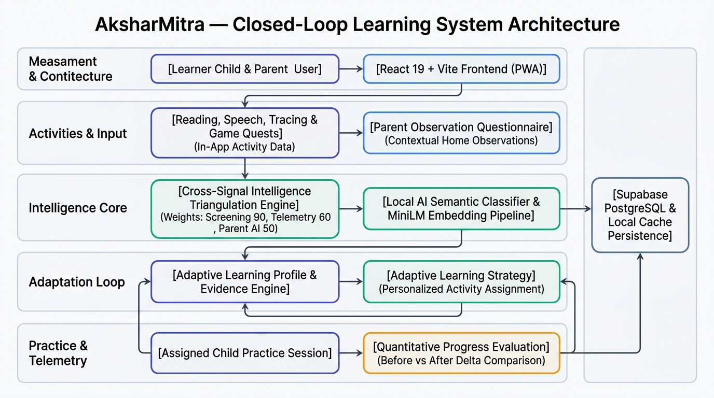

# 🧠 AksharMitra — अक्षरमित्र | অক্ষরমিত্র

> **"Making Reading Accessible in Every Indian Language"**

[](https://aksharmitra.vercel.app/)
[](https://react.dev/)
[](https://vitejs.dev/)
[](https://web.dev/progressive-web-apps/)
[](https://supabase.com/)
[](#-multilingual-support)
[](LICENSE)

---

## 🚀 Live Demo & Judge Walkthrough

Experience AksharMitra live in your browser:  
👉 **[Launch AksharMitra Live Demo (aksharmitra.vercel.app)](https://aksharmitra.vercel.app/)**

### ⚡ 30-Second Quick Demo Guide for Judges
1. Click **[Launch Live Demo](https://aksharmitra.vercel.app/)**.
2. Select the pre-populated **Judge Demo Profile (`Aarav`)**.
3. Open the **Companion Dashboard** to view:
   - **Cross-Signal Triangulation Confidence (90%)** combining screening telemetry and parent observations.
   - **Closed-Loop Telemetry Delta Card** showing quantitative practice improvements ($+18\%$ Tracing Accuracy, $-30\%$ Reversal Rate).
   - **Assigned Practice Recommendations**.
4. Launch **Magic Wand Tracing** (`LetterTracingQuest`) to test real-time Bezier stroke validation, direction checking, and anti-scribble validation.

---

## 🌟 What is AksharMitra?

**AksharMitra** (*Akshar* = Letter, *Mitra* = Friend) is an early literacy learning support companion designed for young learners across India. It provides playful, adaptive learning activities in **English**, **Hindi (हिंदी)**, and **Bengali (বাংলা)** to help children build foundational reading, phonological, and handwriting skills.

AksharMitra bridges the gap between **in-app child activity performance** and **at-home parent observations** through a closed-loop intelligence engine:

$$\text{Learn} \longrightarrow \text{Observe} \longrightarrow \text{Practice} \longrightarrow \text{Improve} \longrightarrow \text{Adapt}$$

> [!IMPORTANT]
> **Educational Learning Support Only**  
> AksharMitra is an **educational practice and support tool**. It is **NOT** a medical or clinical diagnostic system and does **NOT** diagnose dyslexia or clinical reading disorders. All insights represent observed learning patterns to guide personalized practice.

---

## 🎯 The Problem & 💡 Our Solution

### The Challenge
Early literacy milestones—such as letter-sound association, spatial letter orientation (e.g., distinguishing `b` vs `d`), and reading fluency—develop at different paces for every child. When a child experiences hesitation, parents often lack objective insights to support them at home without creating clinical stress.

### Our Solution
AksharMitra combines **objective in-app activity telemetry** (motor tracing stroke precision, reading cadence WPM, speech sound recognition) with **contextual parent home observations** to create a non-judgmental, adaptive learning experience that recommends targeted, gamified practice activities.

---

## ✨ Key Features & Quests

### 🪄 Magic Wand Tracing (`LetterTracingQuest`)
A custom letter-aware motor tracing engine built directly on Bezier path geometry:
- **Stroke-by-Stroke Guidance**: Validates stroke start regions, stroke direction, and multi-stroke ordering.
- **Path Adherence Validation**: Uses dense point-sampling algorithms to prevent off-path scribbling.
- **Spatial Reversal Detection**: Specifically detects belly-orientation reversals (e.g., drawing `b` on the wrong side).
- **Interactive Controls**: Includes Undo, Clear Canvas, "Show Me" auto-demonstration animation, and star sparkle visual rewards.
- **Multi-Script Support**: Validated across English, Devanagari (Hindi), and Bengali letter forms.

```
Expected Stroke Path ──► Sampled Dense Points ──► User Canvas Stroke ──► Adherence % & Reversal Check
```

### 🎮 Screening Island Quests
- **Mirror Letter Quest (`MirrorLetterQuest`)**: Visual discrimination challenges between spatial mirror pairs (`b`/`d`, `p`/`q`).
- **Read-Aloud Quest (`ReadAloudQuest`)**: Speech timing analysis measuring Words Per Minute (WPM) and hesitation cadence.
- **Phonological Sound Quests**:
  - `RhymeBeatsQuest` & `RhymeClapQuest`: Auditory syllable segmentation and rhythm matching.
  - `RhymeMatchQuest` & `SoundSafariQuest`: Phoneme isolation and sound-picture association.

### 🧩 Gamified Learning Practice Hub
- **Word Snapper (`WordSnapper.jsx`)**: Interactive phoneme and letter snapping for word building.
- **Letter Hunter (`LetterHunter.jsx`)**: Speed letter identification and visual scanning.
- **Spelling Clinic (`SpellingClinic.jsx`)**: Phonetic distractor discrimination and spelling reinforcement.
- **Alphabet Train (`AbcFillIn.jsx`)**: Sequence completion and alphabet ordering.
- **Little Explorer (`ExplorerHome.jsx`)**: Low-stress early phonics exploration (`RhymeParty`, `SoundMatchPlay`, `NameThatPicture`).

---

## 🧠 How Adaptive Learning Works

AksharMitra uses a **Cross-Signal Triangulation Engine** that synthesizes two complementary data streams:

```
┌──────────────────────────────────────┐     ┌──────────────────────────────────────┐
│       Objective Child Telemetry       │     │     Contextual Parent Observation    │
│  • Tracing Stroke Accuracy (%)       │     │  • Reading Comfort & Help Level      │
│  • Reading Speed (WPM)               │  +  │  • Word Skipping Frequency           │
│  • Spatial Reversal Rate (%)         │     │  • Letter Sound Blending Comfort     │
│  • Phonological Sound Score (%)      │     │  • Free-Text Observation Notes       │
└──────────────────┬───────────────────┘     └──────────────────┬───────────────────┘
                   │                                            │
                   └─────────────────────┬──────────────────────┘
                                         ▼
                     ┌──────────────────────────────────────┐
                     │   Cross-Signal Intelligence Engine   │
                     │  Triangulates Weighted Evidence      │
                     │  (Screening: 90 | Telemetry: 60)     │
                     └───────────────────┬──────────────────┘
                                         ▼
                     ┌──────────────────────────────────────┐
                     │       Adaptive Learning Profile      │
                     │  • Observed Learning Patterns        │
                     │  • Categorized Evidence Summary      │
                     │  • Target Recommendation Assignment  │
                     └──────────────────────────────────────┘
```

---

## 🔄 Closed-Loop Learning System

When a child completes a recommended practice activity, AksharMitra recalculates the `learningProfile` in real-time by evaluating **Before vs After Telemetry Deltas**:

$$\Delta_{\text{Accuracy}} = \text{Current Accuracy}\% - \text{Baseline Accuracy}\%$$

$$\Delta_{\text{Reversal}} = \text{Baseline Reversal}\% - \text{Current Reversal}\%$$

### Real-Time Telemetry Updates
- **Tracing Accuracy**: Quantifies percentage-point improvement (e.g., $70\% \rightarrow 84\% = +14\%$ percentage points).
- **Reading Speed**: Tracks WPM growth (e.g., $28 \rightarrow 35\text{ WPM} = +7\text{ WPM}$).
- **Spatial Reversal Rate**: Measures reduction in reversal confusion (e.g., $45\% \rightarrow 20\% = -25\%$ percentage points error reduction).
- **Evidence Pipeline**: Updates `evidence.appActivity` with progress markers (`📈 Telemetry Progress`) and helps guide subsequent practice recommendations.

---

## 👨‍👩‍👧 Parent & Educator Dashboard

- **Multi-Category Questionnaire (`ParentObservationModal.jsx`)**: Structured inputs covering reading comfort, word skipping, letter sounds, tracing, and instruction comprehension.
- **Companion Dashboard (`CompanionDashboard.jsx`)**:
  - Displays overall triangulation confidence score and agreement status (`agreement`, `divergence`, `app_only`, `parent_only`).
  - Renders separate evidence badges for `App Activity` vs `Parent Observation`.
  - Displays assigned practice recommendations and before/after progress charts.

---

## 🏗️ System Architecture



### Data Movement Flow
1. **User Interaction**: Child plays screening quests or practice games on the **React 19 + Vite Frontend**.
2. **Telemetry Extraction**: Activity modules emit objective metrics (`tracingAccuracy`, `wpm`, `reversalIndex`, `phonologicalScore`).
3. **Parent Context**: Parents provide home observation signals via the observation modal.
4. **Intelligence Processing**: `@aksharmitra/ai` evaluates signals through `crossSignalIntelligence.js` and updates `learningProfile`.
5. **Strategy & Routing**: `adaptiveLearningStrategy.js` adjusts game guidance levels and assigns the next practice activity.
6. **Persistence & Sync**: `@aksharmitra/database` persists state to **Supabase PostgreSQL** or queues updates in `localStorage` for offline playback.

---

## 🧠 AI/ML Architectural Reality (Transparent Verification)

We believe in complete architectural transparency regarding AI/ML capabilities:

| Component | Architecture Type | Implementation Detail |
|---|---|---|
| **Recommendation Engine** | **Deterministic Weighted Triangulation** | Synthesizes objective scores ($90$ screening, $60$ telemetry) and parent inputs ($50$) in `crossSignalIntelligence.js`. |
| **Parent Observation Classifier** | **Rule-Based Keyword Classifier** | `analyzeParentObservationWithLocalAI` maps parent free-text input to concept tags (`reading`, `speech`, `tracing`). |
| **Local Transformer Model** | **ONNX Feature Extractor** | `localAiEngine.js` exports `getMiniLMExtractor` using `@xenova/transformers` (`Xenova/all-MiniLM-L6-v2`) to compute 384-dimensional dense semantic embeddings. |

> [!NOTE]
> **AI Architecture Note**:  
> The core recommendation system operates deterministically via rule-based weighted signal triangulation. The ONNX MiniLM transformer model acts as an experimental feature extraction pipeline for semantic embeddings and does *not* override recommendation decisions.

---

## 🧩 Project Structure

AksharMitra is structured as a clean npm workspace monorepo:

```
AksharMitra/
├── frontend/               # React 19 + Vite 6 Single Page Application & PWA
│   ├── src/
│   │   ├── screening/      # Letter Tracing, Read-Aloud, Mirror & Sound Quests
│   │   ├── games/          # Word Snapper, Letter Hunter, Spelling Clinic, AbcFillIn
│   │   ├── littleExplorer/ # Phonics exploration games for younger learners
│   │   ├── components/     # CompanionDashboard, ParentObservationModal, UI components
│   │   └── context/        # ProfileContext managing profile state & telemetry triggers
│   └── vite.config.js      # Vite configuration & PWA manifest setup
│
├── ai/                     # @aksharmitra/ai package (Pure JS Intelligence Engine)
│   └── src/
│       ├── crossSignalIntelligence.js  # Triangulation & closed-loop delta logic
│       ├── adaptiveLearningStrategy.js# Guidance & UI adaptation mapping
│       ├── tracingValidation.js       # Stroke direction & path adherence algorithms
│       ├── letterDefinitions.js       # Bezier curve vector stroke definitions
│       └── localAiEngine.js           # Semantic classifier & MiniLM pipeline
│
├── database/               # @aksharmitra/database package (Persistence & Sync)
│   └── src/
│       ├── services/       # Activity, Learner, Progress & Parent observation services
│       ├── lib/            # Supabase client initialization
│       └── supabase_init.sql # PostgreSQL table schemas & RLS policies
│
├── backend/                # @aksharmitra/backend package (Shared Content & Localization)
│   └── src/
│       ├── data/           # Game word banks, translations (EN/HI/BN), demo profiles
│       └── streakUtils.js  # Daily streak calculations
│
├── docs/                   # Architecture diagrams & documentation assets
│   └── architecture.png    # System architecture diagram
├── scratch/                # Verification test scripts
├── vercel.json             # Deployment routing configuration
└── package.json            # Monorepo workspace configuration
```

> [!NOTE]
> The `backend/` directory is a **shared monorepo data package** containing localized content banks, translations, and streak utilities. It is not a standalone Express API server.

---

## 🛠️ Technology Stack

| Layer | Technology | Version | Purpose |
|---|---|---|---|
| **Frontend UI** | React | `^19.0.0` | Modular component user interface |
| **Build System** | Vite | `^6.2.0` | Fast development server & production bundler |
| **Routing** | React Router | `^7.18.4` | SPA navigation |
| **Icons & FX** | Lucide React + Canvas Confetti | `^0.469.0` | Playful UI icons and celebration effects |
| **PWA Tooling** | `vite-plugin-pwa` + Workbox | `^1.3.0` | Web App Manifest, Service Worker & offline caching |
| **Intelligence Engine** | `@aksharmitra/ai` | Monorepo | Cross-signal triangulation & tracing validation |
| **ML Pipeline** | `@xenova/transformers` | `^2.17.2` | In-browser ONNX feature extraction (`all-MiniLM-L6-v2`) |
| **Database / BaaS** | Supabase + PostgreSQL | `@supabase/supabase-js 2.48.1` | Cloud persistence for profiles and telemetry |
| **Local Persistence** | Web Storage API (`localStorage`) | Native | Instant offline cache & mutation queue |
| **Hosting** | Vercel | Production | Edge deployment with SPA rewrite rules |

---

## 📱 Progressive Web App (PWA)

AksharMitra is built as a fully installable **Progressive Web App**:
- **Offline Playback**: Service Worker (`sw.js`) precaches core application bundles, assets, and learning content.
- **Installable**: Includes Web App Manifest (`manifest.webmanifest`) with standalone display mode and theme color `#4F46E5`.
- **Offline Data Sync**: The offline sync service queues activity attempts locally when disconnected and syncs automatically upon network reconnection.

---

## 🌍 Multilingual Support

AksharMitra provides native language localization across **3 major Indian languages**:

| Language | Code | Native Name | Script | UI & Voice Status |
|---|---|---|---|---|
| **English** | `en` | English | Latin | Full Support |
| **Hindi** | `hi` | हिंदी | Devanagari | Full Support |
| **Bengali** | `bn` | বাংলা | Bengali | Full Support |

Localization covers UI text, audio speech synthesis prompts (subject to browser Web Speech API availability), activity feedback, and parent observation forms.

---

## 🧪 Testing & Verification

AksharMitra includes verification test suites for core logic:

- **Closed-Loop System Test**: `scratch/testClosedLoopSystem.js` validates Before vs After delta calculations and evidence compilation.
- **Tracing Matrix Test**: `scratch/testTracingMatrix.js` verifies stroke path adherence algorithms.
- **Production Build Test**: `npm run build --workspace=frontend` builds cleanly with Vite.

To run the verification test:
```bash
node scratch/testClosedLoopSystem.js
```

---

## 🚀 Getting Started

### Prerequisites
- **Node.js**: v18.0.0 or higher
- **npm**: v9.0.0 or higher

### Installation

1. **Clone the Repository**:
   ```bash
   git clone https://github.com/Biraj021/AksharMitra.git
   cd AksharMitra
   ```

2. **Install Dependencies**:
   ```bash
   npm install
   ```

3. **Start Development Server**:
   ```bash
   npm run dev
   ```
   Open your browser at `http://localhost:3000`.

---

## 🔑 Environment Variables

Copy `.env.example` to `.env` in the root directory (or `database/.env`):

```env
# Optional Supabase Integration (Falls back gracefully to LocalStorage if unconfigured)
VITE_SUPABASE_URL=https://your-supabase-project.supabase.co
VITE_SUPABASE_ANON_KEY=your-supabase-anon-key
```

---

## 🏗️ Production Build & Deployment

To create an optimized production build:

```bash
npm run build
```

### Vercel Deployment
The repository includes `vercel.json` preconfigured for SPA routing and PWA headers:
```json
{
  "buildCommand": "cd frontend && npm install && npm run build",
  "outputDirectory": "frontend/dist"
}
```

---

## 🗺️ Roadmap

- [x] **Closed-Loop Telemetry System**: Real-time Before vs After delta tracking for tracing accuracy, reading speed, and spatial reversal rates.
- [x] **Magic Wand Tracing Engine**: Bezier path validation, stroke direction checking, and mirror letter belly orientation detection.
- [x] **PWA Offline Support**: Workbox service worker precaching and offline local storage mutation queue.
- [x] **Multilingual Support**: Complete English, Hindi, and Bengali localization.
- [ ] 🚧 **Expanded Devanagari & Bengali Stroke Libraries**: Adding complex conjunct stroke definitions (`संयुक्त अक्षर`).
- [ ] 🔮 **Direct Vector Distance Classification**: Connecting MiniLM cosine distance directly to parent free-text observation processing.

---

## 🔗 Quick Links

- 🚀 **Live Demo**: [https://aksharmitra.vercel.app/](https://aksharmitra.vercel.app/)
- 🐙 **GitHub Repository**: [https://github.com/Biraj021/AksharMitra](https://github.com/Biraj021/AksharMitra)
- 🏗️ **Architecture Diagram**: [`docs/architecture.png`](docs/architecture.png)

---

## ⚠️ Safety & Non-Medical Disclaimer

> **IMPORTANT NOTICE**  
> AksharMitra is designed purely as an **educational practice and assistive learning tool**. It does **NOT** offer medical, clinical, or diagnostic evaluations for dyslexia, dysgraphia, or any speech/language disorders. All recommendations and progress metrics reflect educational activity patterns intended to make practice fun and engaging for young learners.

---

## 📄 License

Distributed under the **MIT License**. See `LICENSE` for details.

---

<p align="center">
  Made with ❤️ for early learners across India.
</p>
