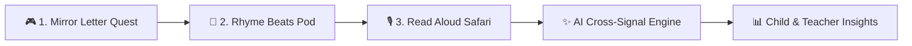

# ✨ AksharMitra (अक्षर मित्र / অক্ষর মিত্র)

<div align="center">

```
   ___     _        _                 __  __ _ _             
  / _ \   | |      | |               |  \/  (_) |            
 / /_\ \  | | _____| |__   __ _ _ __ | \  / |_| |_ _ __ __ _ 
 |  _  |  | |/ / __| '_ \ / _` | '__|| |\/| | | __| '__/ _` |
 | | | |  |   <\__ \ | | | (_| | |   | |  | | | |_| | | (_| |
 \_| |_/  |_|\_\___/_| |_|\__,_|_|   |_|  |_|_|\__|_|  \__,_|
```

[](https://react.dev/)
[](https://vitejs.dev/)
[](https://supabase.com/)
[](https://web.dev/progressive-web-apps/)
[](https://www.w3.org/WAI/)
[](https://github.com/Biraj021/AksharMitra)

### 🌟 *Gamified, Non-Stigmatizing Early Dyslexia Risk-Screening & Adaptive Phonics Quest Universe*
**Designed for neurodiverse young learners, classrooms, and parents.**

[🚀 Live Demo](https://akshar-mitra-17wqhq5jn-biraj021s-projects.vercel.app) • [📖 Monorepo](#-monorepo-structure) • [🎮 Game Modules](#-game-modules--adventure-islands) • [🧪 Screening Suite](#-3-step-non-stigmatizing-screening-quest) • [🛠️ Setup](#-quick-start)

</div>

---

## 🌈 The Vision

Over **10–15% of children** worldwide experience dyslexia or phonological processing differences. In multilingual nations, early screening is often delayed until Grade 3 or 4, typically delivered via stressful clinical assessment sheets that induce math and reading anxiety in children.

**AksharMitra** re-imagines early literacy diagnostics as an **immersive 3D quest universe**:
- 🏰 **Joyful, Non-Clinical Screening**: Embedded into interactive story quests with **Mitra the Wise Owl**.
- 🍬 **Tactile 3D Candy Letter Physics**: Physical button depressions, glossy finishes, and acoustic phoneme feedback designed for children with sensory and graphomotor needs.
- 🌐 **True Multilingual Trilingualism**: Native phonics and letter reversal detection across **English**, **Bengali (বাংলা)**, and **Hindi (हिन्दी)**.
- 👩‍🏫 **Educator Diagnostics Cockpit**: Live student rosters, diagnostic flags, and 1-click Kid Code linking for teachers and reading specialists.
- ⚡ **Zero-Latency Offline-First**: Instant sub-50ms hydration with local caching and asynchronous Supabase cloud sync.

---

## 🗺️ 3D Adventure Islands & Game Modules

AksharMitra features an **S-Curve winding 3D Adventure Trail Map** with distinct biomes, animated player pins, and sensory game mechanics:

```
          [ 🌲 Enchanted Forest ]  ───────►  Whispering Woods (Letter Island)
                     │
                     ▼
          [ 🌊 Sunlit Lagoon ]     ───────►  Phonics Waves (Sound Safari)
                     │
                     ▼
          [ 🏰 Crystal Citadel ]   ───────►  Word Castle (Spelling & Traps)
```

| Realm / Island | Game Module | Target Skill & Remediation |
|---|---|---|
| **🌲 Whispering Forest**<br>`Letter Island` | 🦅 **Letter Hunter** (*Eagle Eye Radar*) | 3D Sonar Bubble Grid targeting mirror letter discrimination (`b` vs `d`, `p` vs `q`, `ब` vs `भ`, `ব` vs `র`). |
| | ✍️ **Magic Wand Tracing** | Clinical 4-line magnetic waypoint vector canvas with real-time directionality correction. |
| **🌊 Sunlit Lagoon**<br>`Sound Safari` | 🧩 **Word Snapper** | Holographic Phonics Pod with magnetic slot receptors and 3D candy letter tiles. |
| | 🚂 **Alphabet Train Express** | Missing sequential wagon sorting for auditory phonological ordering. |
| **🏰 Crystal Citadel**<br>`Word Castle` | ⚡ **Spelling Trap Spotter** | Rapid visual transposition buster catching letter reversals (`FROM` vs `FORM`, `WAS` vs `SAW`, `जल` vs `लज`). |
| | 🧠 **Memory Spell Clinic** | 3-step Look-Cover-Spell workflow + clinical dysgraphia 4-line stroke guidance. |

---

## 🧪 3-Step Non-Stigmatizing Screening Quest

Instead of an intimidating test, learners embark on a **3-minute diagnostic adventure**:



1. **Mirror Letter Quest (Visual-Spatial Signal)**:
   - Evaluates rotational confusion, mirror symmetry discrimination, and letter orientation hesitation.
2. **Rhyme Beats Pod (Auditory-Phonological Signal)**:
   - Interactive rhythm drum pads testing phoneme isolation, onset-rime blending, and auditory distinction.
3. **Read Aloud Safari (Fluency & Rapid Naming Signal)**:
   - Real-time continuous speech recognition measuring Words Per Minute (WPM), hesitation pauses, and phonetic substitution patterns.

---

## 👩‍🏫 Multi-Portal Role Architecture

AksharMitra is built with **strict window separation** tailored for three core users:

```
┌─────────────────────────── AksharMitra ───────────────────────────┐
│                                                                   │
│   🎒 Student Kingdom           👩‍🏫 Educator Cockpit       👨‍👩‍👧 Parent Portal    │
│   • 3D Clubhouse & Avatars     • Classroom Student Roster • Reading Milestones │
│   • 3D Adventure Trail Map     • Screening Risk Badges    • Daily Practice Log │
│   • Candy Letter Phonics       • 1-Click Student Link     • Home Guidance Tips │
│   • Daily Reward Stars         • Diagnostic Analytics     • Dyslexia Settings  │
│                                                                   │
└───────────────────────────────────────────────────────────────────┘
```

---

## 🌐 Multilingual Phonics Architecture

AksharMitra natively processes phonological and script structures across three languages:

| Feature | 🇬🇧 English | 🇮🇳 Bengali (বাংলা) | 🇮🇳 Hindi (हिन्दी) |
|---|---|---|---|
| **Script Family** | Latin Alphabet | Eastern Nagari (বাংলা লিপি) | Devanagari (देवनागरी) |
| **Reversal Pairs** | `b` ⟷ `d`, `p` ⟷ `q`, `m` ⟷ `w` | `ব` ⟷ `র`, `দ` ⟷ `ধ`, `ন` ⟷ `ম` | `ब` ⟷ `भ`, `द` ⟷ `ध`, `प` ⟷ `ष` |
| **Transpositions** | `was` ⟷ `saw`, `from` ⟷ `form` | `জল` ⟷ `লজ`, `ফল` ⟷ `লফ` | `जल` ⟷ `लज`, `कमल` ⟷ `कलम` |
| **Audio TTS Engine** | `en-US` / `en-IN` | `bn-IN` | `hi-IN` |
| **Font Rendering** | Lexend & Inter | Noto Sans Bengali | Noto Sans Devanagari |

---

## ♿ Dyslexia & Accessibility First-Class Features

- 👓 **Reading Ruler**: Movable spotlight guide overlay reducing visual crowding and line-skipping.
- 🔤 **Lexend & OpenDyslexic Typography**: Wider letter apertures and bottom-weighted baselines.
- 🎨 **Anti-Glare Color Themes**: Pastel Parchment, Sage Forest, and Velvet Lagoon avoiding harsh bright white contrasts.
- 🔊 **Zero-Latency Web Audio & TTS**: Oscillator-based acoustic reward cues with instant speech synthesis.

---

## 🗂️ Monorepo Structure

```
AksharMitra/
├── frontend/               ← React 19 + Vite 6 Progressive Web App (PWA)
│   ├── src/
│   │   ├── components/
│   │   │   ├── auth/       (AuthPage, Student Pass, Teacher Registration)
│   │   │   ├── common/     (Header HUD, BottomNav, ReadingRuler, GameWorldBackdrop)
│   │   │   ├── dashboard/  (CompanionDashboard, Student Hero Telemetry Cards)
│   │   │   ├── landing/    (LandingHero 3D Clubhouse, Daily Mini-Quests)
│   │   │   └── screening/  (ScreeningContainer, 3-Step Quest Flow)
│   │   ├── context/        (ProfileContext, AudioContext, DyslexiaContext)
│   │   ├── games/          (GamesHub Trail Map, WordSnapper, LetterHunter, SpellingClinic)
│   │   ├── littleExplorer/ (Preschool Sound Match, Rhyme Party, Picture Naming)
│   │   ├── index.css       (3D Candy Tokens, Biome Themes, Gloss Highlights)
│   │   └── App.jsx         (Adaptive Routing & Play Environment)
│   ├── vite.config.js
│   └── package.json
│
├── ai/                     ← Cross-signal AI & adaptive scaffolding engine
│   ├── src/
│   │   ├── adaptiveLearningStrategy.js
│   │   ├── crossSignalIntelligence.js
│   │   ├── localAiEngine.js
│   │   ├── parentFeedbackModel.js
│   │   └── tracingValidation.js
│   └── package.json
│
├── database/               ← Cloud-native Supabase PostgreSQL & offline queue
│   ├── src/
│   │   ├── lib/supabaseClient.js
│   │   └── services/       (learner, activity, parent observation, offline sync)
│   ├── migrations/         (SQL Schema migrations)
│   └── package.json
│
├── backend/                ← Shared multilingual data & utilities
│   ├── src/
│   │   ├── data/           (languages, translations, demo profiles)
│   │   └── streakUtils.js
│   └── package.json
│
└── package.json            ← Monorepo root workspace configuration
```

---

## 🛠️ Technology Stack

| Component | Technology | Description |
|---|---|---|
| **Frontend Framework** | **React 19 + Vite 6** | Ultra-responsive component architecture with sub-second HMR |
| **Database & Auth** | **Supabase (PostgreSQL 15)** | Cloud-native relational store with strict Row Level Security (RLS) |
| **Offline Architecture** | **Service Workers + IndexedDB/LocalStorage** | Autonomous offline queue with auto-replay on reconnect |
| **Acoustic Engine** | **Web Audio API** | Real-time synthetic pitch oscillators and spatial audio cues |
| **Speech Processing** | **Web Speech API & TTS** | Continuous multilingual streaming speech recognition |
| **Vector Canvas** | **HTML5 2D Canvas** | Real-time stroke interpolation and magnetic snapping algorithms |
| **Visual Effects** | **Canvas Confetti & CSS 3D** | Hardware-accelerated celebrate bursts, specular gloss, and drop shadows |
| **Icons & Typography** | **Lucide React + Google Fonts** | Crisp SVG vector glyphs with Lexend, Outfit, and Noto families |

---

## 🚀 Quick Start

### 1. Prerequisites
- [Node.js](https://nodejs.org/) (v18.x or v20.x+)
- `npm`

### 2. Clone & Install
```bash
# Clone the repository
git clone https://github.com/Biraj021/AksharMitra.git
cd AksharMitra

# Install all monorepo workspace dependencies
npm install
```

### 3. Environment Variables (Optional for Supabase Cloud Sync)
Create a `.env` file in `frontend/` (or root):
```env
VITE_SUPABASE_URL=your_supabase_project_url
VITE_SUPABASE_ANON_KEY=your_supabase_anon_public_key
```
*(If no Supabase credentials are provided, AksharMitra automatically runs in seamless local offline mode).*

### 4. Run Development Server
```bash
npm run dev
```
Open **[http://localhost:3000](http://localhost:3000)** in Google Chrome or Microsoft Edge.

### 5. Production Build
```bash
npm run build
```

---

## 👥 Team & Acknowledgments

*Crafted with ❤️ for **Hacksynthesis UEM 30-Hour Hackathon**.*  
*Empowering every young learner to discover the joy of reading without fear or stigma.*
